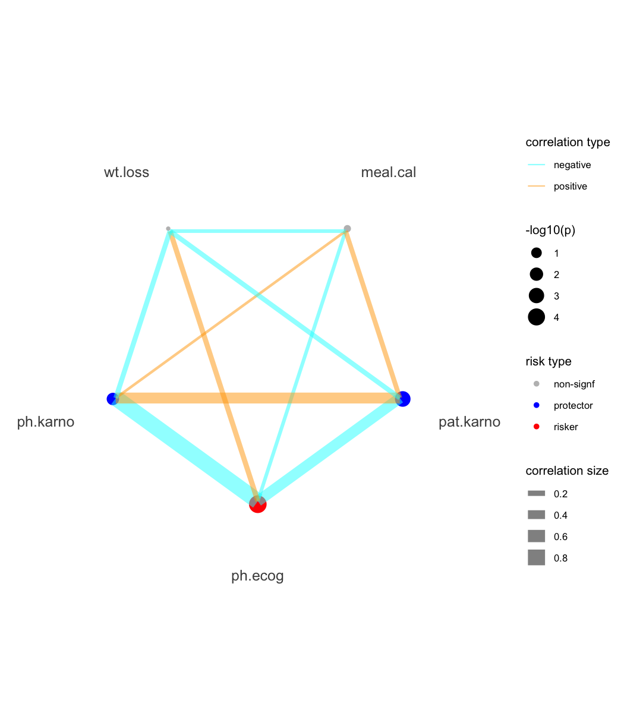

<!-- README.md is generated from README.Rmd. Please edit that file -->

# bregr: Easy and Efficient Batch Processing of Regression Models in R

<!-- badges: start -->

[](https://CRAN.R-project.org/package=bregr)
[](https://cran.r-project.org/package=bregr)
[](https://github.com/WangLabCSU/bregr/actions/workflows/R-CMD-check.yaml)
<!-- badges: end -->

The **bregr** package is designed to simplify and streamline the process
of **b**atch processing **reg**ression models in **R**. Whether you’re
working with univariate or multivariate models, bregr makes it easy to
handle multiple analyses at once. The package returns results in a tidy
format, ensuring that the output is organized and accessible for further
analysis or reporting. Additionally, bregr generates clear visualization
plots that aid in the straightforward interpretation of model results.
This makes it an invaluable tool for anyone working with regression
models in R, allowing you to focus more on deriving insights and less on
the mechanics of setting up and processing models.

## A overview of regression modeling in batch

Regression modeling in batch involves constructing a series of
regression models with same or different dependent variables $y_i$ in
each model, different independent variables $x_i$ of interest (focal) in
each model, and constant variables (constant) in all models.

$$
y_1 = \alpha_1 x_1 + \beta_1 c_1 + \gamma_1 c_2 \\
y_2 = \alpha_2 x_1 + \beta_2 c_1 + \gamma_2 c_2 \\
y_3 = \alpha_3 x_1 + \beta_3 c_1 + \gamma_3 c_2 \\
\cdots \\
y_4 = \alpha_n x_n + \beta_n c_1 + \gamma_4 c_2 \\
$$

## Installation

You can install the stable version of bregr from CRAN with:

``` r
install.packages("bregr")
```

You can install the development version of bregr from
[GitHub](https://github.com/) with:

``` r
# install.packages("pak")
pak::pak("WangLabCSU/bregr")
```

## Usage

Load package(s):

``` r
library(bregr)
#> Welcome to 'bregr' package!
#> =======================================================================
#> You are using bregr version 1.0.0
#> 
#> Project home : https://github.com/WangLabCSU/bregr
#> Documentation: https://wanglabcsu.github.io/bregr/
#> Cite as      : arXiv:2110.14232
#> =======================================================================
#> 
```

Load data:

``` r
lung = survival::lung
lung$ph.ecog = factor(lung$ph.ecog)
```

The design and implementation of bregr follow [Tidy design
principles](https://design.tidyverse.org/) and [Tidyverse style
guide](https://style.tidyverse.org/), which is easy to understand and
use.

### Basics and workflow

1.  Construct a `breg` object:

``` r
breg(lung)
#> A object of <breg> class with slots:
#> • y (response variable):
#> • x (focal term):
#> • x2 (control term):
#> • group_by:
#> • data: <tibble[,11]>
#> • config: NULL
#> • models: <list: >
#> • results: <df[,0]> with colnames
#> • results_tidy: <df[,0]> with colnames
#> 
#> Focal term(s) are injected into the model one by one,
#> while control term(s) remain constant across all models in the batch.
```

2.  Set model response (i.e., dependent) variable(s):

``` r
breg(lung) |> 
  br_set_y(c("time", "status"))
#> A object of <breg> class with slots:
#> • y (response variable): time and status
#> • x (focal term):
#> • x2 (control term):
#> • group_by:
#> • data: <tibble[,11]>
#> • config: NULL
#> • models: <list: >
#> • results: <df[,0]> with colnames
#> • results_tidy: <df[,0]> with colnames
#> 
#> Focal term(s) are injected into the model one by one,
#> while control term(s) remain constant across all models in the batch.
```

2.  Set model predictor (i.e., independent) variables. In batch
    analysis, this is divided into two parts: 1) focal variables and 2)
    control variables.

Focal variables are injected into constructed models one by one, while
control variables remain constant across all constructed models.

``` r
breg(lung) |> 
  br_set_y(c("time", "status")) |>
  br_set_x(colnames(lung)[6:10]) |>   # set focal terms
  br_set_x2(c("age", "sex"))          # set control terms, this is optional
#> A object of <breg> class with slots:
#> • y (response variable): time and status
#> • x (focal terms): ph.ecog, ph.karno, pat.karno, meal.cal, and wt.loss
#> • x2 (control terms): age and sex
#> • group_by:
#> • data: <tibble[,11]>
#> • config: NULL
#> • models: <list: >
#> • results: <df[,0]> with colnames
#> • results_tidy: <df[,0]> with colnames
#> 
#> Focal term(s) are injected into the model one by one,
#> while control term(s) remain constant across all models in the batch.
```

> `terms` is desribed in the result object as bregr supports a more
> broader scope of predictors. e.g., `x + poly(x, 2)` has one variable
> x, but two terms `x` and `poly(x, 2)`.

3.  Set model configuration.

Here, “coxph” (Cox-PH) for survival analysis is given.

``` r
mds = breg(lung) |> 
  br_set_y(c("time", "status")) |>
  br_set_x(colnames(lung)[6:10]) |>
  br_set_x2(c("age", "sex")) |> 
  br_set_model("coxph")
mds
#> A object of <breg> class with slots:
#> • y (response variable): time and status
#> • x (focal terms): ph.ecog, ph.karno, pat.karno, meal.cal, and wt.loss
#> • x2 (control terms): age and sex
#> • group_by:
#> • data: <tibble[,11]>
#> • config: <list: method = "coxph", extra = "">
#> • models: <list: ph.ecog = <glue>, ph.karno = <glue>, pat.karno = <glue>, and
#> meal.cal = <glue>, wt.loss = <glue>>
#> • results: <df[,0]> with colnames
#> • results_tidy: <df[,0]> with colnames
#> 
#> Focal term(s) are injected into the model one by one,
#> while control term(s) remain constant across all models in the batch.
```

We can check constructed model formulas in text format.

``` r
br_get_models(mds)
#> $ph.ecog
#> survival::coxph(survival::Surv(time, status) ~ ph.ecog + age + sex, data = data)
#> 
#> $ph.karno
#> survival::coxph(survival::Surv(time, status) ~ ph.karno + age + sex, data = data)
#> 
#> $pat.karno
#> survival::coxph(survival::Surv(time, status) ~ pat.karno + age + sex, data = data)
#> 
#> $meal.cal
#> survival::coxph(survival::Surv(time, status) ~ meal.cal + age + sex, data = data)
#> 
#> $wt.loss
#> survival::coxph(survival::Surv(time, status) ~ wt.loss + age + sex, data = data)
# or mds@models
```

4.  The final step is constructing modeling with data and options
    defined above.

``` r
mds = breg(lung) |> 
  br_set_y(c("time", "status")) |>
  br_set_x(colnames(lung)[6:10]) |>
  br_set_x2(c("age", "sex")) |> 
  br_set_model("coxph") |>
  br_run()
#> set `exponentiate=TRUE` for model(s) constructed from coxph method at default
mds
#> A object of <breg> class with slots:
#> • y (response variable): time and status
#> • x (focal terms): ph.ecog, ph.karno, pat.karno, meal.cal, and wt.loss
#> • x2 (control terms): age and sex
#> • group_by:
#> • data: <tibble[,11]>
#> • config: <list: method = "coxph", extra = "">
#> • models: <list: ph.ecog = <coxph>, ph.karno = <coxph>, pat.karno = <coxph>,
#> and meal.cal = <coxph>, wt.loss = <coxph>>
#> • results: <tibble[,21]> with colnames Focal_variable, term, variable,
#> var_label, var_class, var_type, var_nlevels, contrasts, contrasts_type,
#> reference_row, label, n_obs, n_ind, n_event, exposure, estimate, std.error,
#> statistic, …, conf.low, and conf.high
#> • results_tidy: <tibble[,8]> with colnames Focal_variable, term, estimate,
#> std.error, statistic, p.value, conf.low, and conf.high
#> 
#> Focal term(s) are injected into the model one by one,
#> while control term(s) remain constant across all models in the batch.
```

Now the `models` slot has been updated to real model objects:

``` r
br_get_models(mds)
#> $ph.ecog
#> Call:
#> survival::coxph(formula = survival::Surv(time, status) ~ ph.ecog + 
#>     age + sex, data = data)
#> 
#>               coef exp(coef)  se(coef)      z        p
#> ph.ecog1  0.410048  1.506890  0.199604  2.054  0.03995
#> ph.ecog2  0.903303  2.467741  0.228078  3.960 7.48e-05
#> ph.ecog3  1.954543  7.060694  1.029701  1.898  0.05767
#> age       0.010795  1.010853  0.009312  1.159  0.24637
#> sex      -0.545831  0.579360  0.168228 -3.245  0.00118
#> 
#> Likelihood ratio test=30.87  on 5 df, p=9.952e-06
#> n= 227, number of events= 164 
#>    (1 observation deleted due to missingness)
#> 
#> $ph.karno
#> Call:
#> survival::coxph(formula = survival::Surv(time, status) ~ ph.karno + 
#>     age + sex, data = data)
#> 
#>               coef exp(coef)  se(coef)      z       p
#> ph.karno -0.013322  0.986767  0.005880 -2.266 0.02348
#> age       0.012375  1.012452  0.009405  1.316 0.18821
#> sex      -0.497170  0.608249  0.167713 -2.964 0.00303
#> 
#> Likelihood ratio test=18.81  on 3 df, p=0.0002987
#> n= 227, number of events= 164 
#>    (1 observation deleted due to missingness)
#> 
#> $pat.karno
#> Call:
#> survival::coxph(formula = survival::Surv(time, status) ~ pat.karno + 
#>     age + sex, data = data)
#> 
#>                coef exp(coef)  se(coef)      z        p
#> pat.karno -0.019061  0.981120  0.005638 -3.381 0.000722
#> age        0.011793  1.011863  0.009331  1.264 0.206269
#> sex       -0.519262  0.594959  0.168967 -3.073 0.002118
#> 
#> Likelihood ratio test=24.33  on 3 df, p=2.133e-05
#> n= 225, number of events= 162 
#>    (3 observations deleted due to missingness)
#> 
#> $meal.cal
#> Call:
#> survival::coxph(formula = survival::Surv(time, status) ~ meal.cal + 
#>     age + sex, data = data)
#> 
#>                coef  exp(coef)   se(coef)      z     p
#> meal.cal -0.0001341  0.9998659  0.0002383 -0.563 0.574
#> age       0.0152942  1.0154117  0.0105352  1.452 0.147
#> sex      -0.4914187  0.6117579  0.1908601 -2.575 0.010
#> 
#> Likelihood ratio test=10.65  on 3 df, p=0.01376
#> n= 181, number of events= 134 
#>    (47 observations deleted due to missingness)
#> 
#> $wt.loss
#> Call:
#> survival::coxph(formula = survival::Surv(time, status) ~ wt.loss + 
#>     age + sex, data = data)
#> 
#>               coef  exp(coef)   se(coef)      z      p
#> wt.loss  0.0007596  1.0007599  0.0061934  0.123 0.9024
#> age      0.0200882  1.0202913  0.0096644  2.079 0.0377
#> sex     -0.5210319  0.5939074  0.1743541 -2.988 0.0028
#> 
#> Likelihood ratio test=14.67  on 3 df, p=0.002122
#> n= 214, number of events= 152 
#>    (14 observations deleted due to missingness)
```

Tidy and comprehensive modeling results can be obtained from slots
`results_tidy` and `results`, respectively.

``` r
br_get_results(mds, tidy = TRUE)
#> # A tibble: 17 × 8
#>    Focal_variable term   estimate std.error statistic p.value conf.low conf.high
#>    <chr>          <chr>     <dbl>     <dbl>     <dbl>   <dbl>    <dbl>     <dbl>
#>  1 ph.ecog        ph.ec…    1.51   0.200        2.05  3.99e-2    1.02      2.23 
#>  2 ph.ecog        ph.ec…    2.47   0.228        3.96  7.48e-5    1.58      3.86 
#>  3 ph.ecog        ph.ec…    7.06   1.03         1.90  5.77e-2    0.938    53.1  
#>  4 ph.ecog        age       1.01   0.00931      1.16  2.46e-1    0.993     1.03 
#>  5 ph.ecog        sex       0.579  0.168       -3.24  1.18e-3    0.417     0.806
#>  6 ph.karno       ph.ka…    0.987  0.00588     -2.27  2.35e-2    0.975     0.998
#>  7 ph.karno       age       1.01   0.00940      1.32  1.88e-1    0.994     1.03 
#>  8 ph.karno       sex       0.608  0.168       -2.96  3.03e-3    0.438     0.845
#>  9 pat.karno      pat.k…    0.981  0.00564     -3.38  7.22e-4    0.970     0.992
#> 10 pat.karno      age       1.01   0.00933      1.26  2.06e-1    0.994     1.03 
#> 11 pat.karno      sex       0.595  0.169       -3.07  2.12e-3    0.427     0.829
#> 12 meal.cal       meal.…    1.00   0.000238    -0.563 5.74e-1    0.999     1.00 
#> 13 meal.cal       age       1.02   0.0105       1.45  1.47e-1    0.995     1.04 
#> 14 meal.cal       sex       0.612  0.191       -2.57  1.00e-2    0.421     0.889
#> 15 wt.loss        wt.lo…    1.00   0.00619      0.123 9.02e-1    0.989     1.01 
#> 16 wt.loss        age       1.02   0.00966      2.08  3.77e-2    1.00      1.04 
#> 17 wt.loss        sex       0.594  0.174       -2.99  2.80e-3    0.422     0.836
br_get_results(mds)
#> # A tibble: 18 × 21
#>    Focal_variable term      variable  var_label var_class var_type   var_nlevels
#>    <chr>          <chr>     <chr>     <chr>     <chr>     <chr>            <int>
#>  1 ph.ecog        ph.ecog0  ph.ecog   ph.ecog   factor    categoric…           4
#>  2 ph.ecog        ph.ecog1  ph.ecog   ph.ecog   factor    categoric…           4
#>  3 ph.ecog        ph.ecog2  ph.ecog   ph.ecog   factor    categoric…           4
#>  4 ph.ecog        ph.ecog3  ph.ecog   ph.ecog   factor    categoric…           4
#>  5 ph.ecog        age       age       age       numeric   continuous          NA
#>  6 ph.ecog        sex       sex       sex       numeric   continuous          NA
#>  7 ph.karno       ph.karno  ph.karno  ph.karno  numeric   continuous          NA
#>  8 ph.karno       age       age       age       numeric   continuous          NA
#>  9 ph.karno       sex       sex       sex       numeric   continuous          NA
#> 10 pat.karno      pat.karno pat.karno pat.karno numeric   continuous          NA
#> 11 pat.karno      age       age       age       numeric   continuous          NA
#> 12 pat.karno      sex       sex       sex       numeric   continuous          NA
#> 13 meal.cal       meal.cal  meal.cal  meal.cal  numeric   continuous          NA
#> 14 meal.cal       age       age       age       numeric   continuous          NA
#> 15 meal.cal       sex       sex       sex       numeric   continuous          NA
#> 16 wt.loss        wt.loss   wt.loss   wt.loss   numeric   continuous          NA
#> 17 wt.loss        age       age       age       numeric   continuous          NA
#> 18 wt.loss        sex       sex       sex       numeric   continuous          NA
#> # ℹ 14 more variables: contrasts <chr>, contrasts_type <chr>,
#> #   reference_row <lgl>, label <chr>, n_obs <dbl>, n_ind <dbl>, n_event <dbl>,
#> #   exposure <dbl>, estimate <dbl>, std.error <dbl>, statistic <dbl>,
#> #   p.value <dbl>, conf.low <dbl>, conf.high <dbl>
```

We can see that the whole workflow is easy to read and they are combined
by R native operators.

    breg(lung) |> 
      br_set_y(c("time", "status")) |>
      br_set_x(colnames(lung)[6:10]) |>
      br_set_x2(c("age", "sex")) |> 
      br_set_model("coxph") |>
      br_run()

### Pipeline function

Given the develop experience in
[ezcox](https://github.com/ShixiangWang/ezcox/), we create a pipeline
function for common one-step use.

``` r
br_pipeline(
  lung,
  y = c("time", "status"),
  x = colnames(lung)[6:10],
  x2 = c("age", "sex"),
  method = "coxph"
)
```

### Visualization

bregr mainly provides `br_show_forest()` for result data.

``` r
br_show_forest(mds)
```



## Coverage

``` r
covr::package_coverage()
#> bregr Coverage: 82.20%
#> R/98-utils.R: 41.03%
#> R/04-show.R: 80.21%
#> R/03-accessors.R: 82.86%
#> R/02-pipeline.R: 90.48%
#> R/99-zzz.R: 90.91%
#> R/05-polar.R: 97.37%
#> R/01-class.R: 100.00%
#> R/06-avail.R: 100.00%
```

## LICENSE

(GPL-3) Copyright (c) 2025 Shixiang Wang & WangLabCSU team
