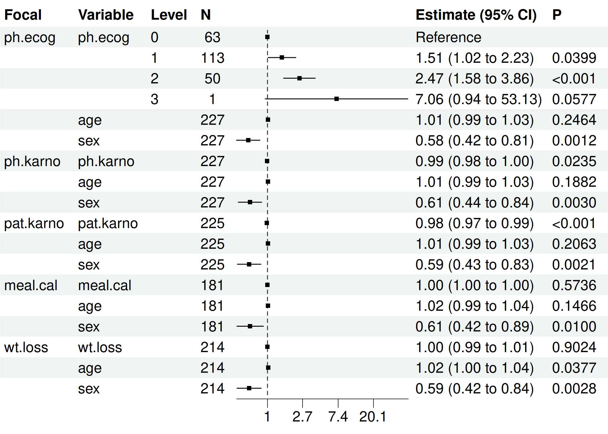
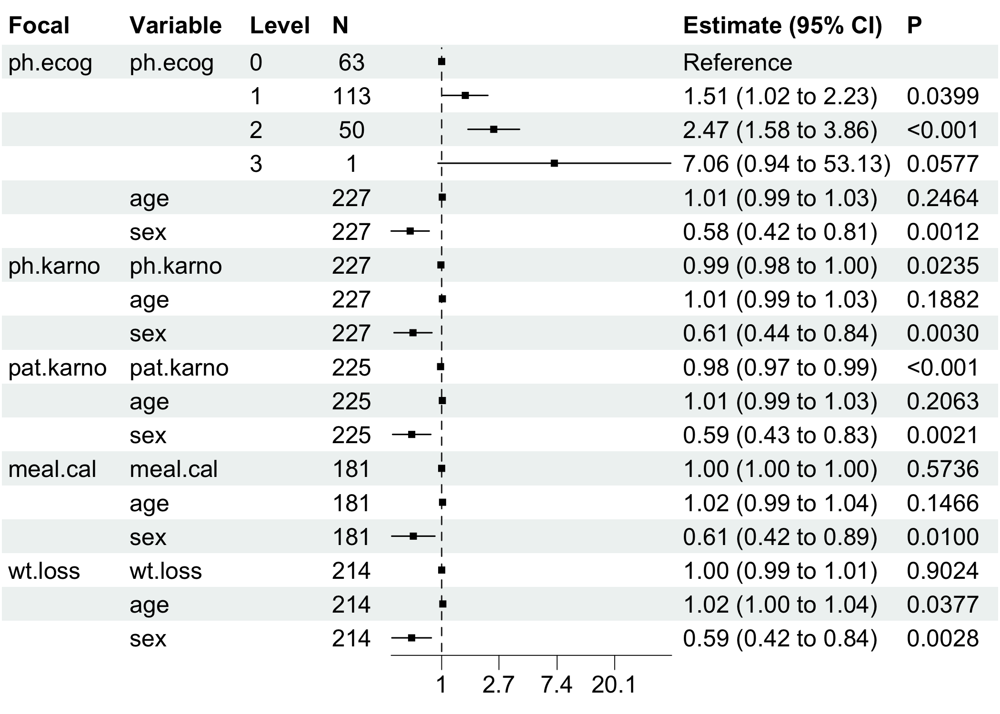

<!-- README.md is generated from README.Rmd. Please edit that file -->

# bregr: Easy and Efficient Batch Processing of Regression Models in R

<!-- badges: start -->

[](https://CRAN.R-project.org/package=bregr)
[](https://cran.r-project.org/package=bregr)
[](https://github.com/WangLabCSU/bregr/actions/workflows/R-CMD-check.yaml)
<!-- badges: end -->

The **bregr** package revolutionizes batch regression modeling in R,
enabling you to run **hundreds of models simultaneously** with a clean,
intuitive workflow. Designed for both univariate and multivariate
analyses, it delivers **tidy-formatted results** and publication-ready
visualizations, transforming cumbersome statistical workflows into
efficient pipelines.

## Key Features

- 🚀 **Batch Processing**: Automate regression modeling across multiple
  dependent/independent variables.
- 📊 **Tidy Output**: Structured results compatible with `tidyverse` for
  seamless downstream analysis.
- 📈 **Integrated Visualization**: One-command forest plots and model
  diagnostics.
- ⚡️ **Unified Workflow**: Chain operations with native R pipes (`|>`).
- 📦 **Model Agnostic**: Supports linear models, Cox regression, and
  more.

## Batch Regression Modeling Overview

Batch regression streamlines analyses where:

- Each model shares **identical control variables** (`c₁, c₂...`)
- **Focal predictors** (`x₁, x₂...`) or **responses** (`y₁, y₂...`) vary
  systematically

``` math
y_1 = \alpha_1 x_1 + \beta_1 c_1 + \gamma_1 c_2 \\
y_2 = \alpha_2 x_1 + \beta_2 c_1 + \gamma_2 c_2 \\
y_3 = \alpha_3 x_1 + \beta_3 c_1 + \gamma_3 c_2 \\
... \\
y_4 = \alpha_n x_n + \beta_n c_1 + \gamma_4 c_2 \\
```

## Installation

You can install the stable version of bregr from CRAN with:

``` r
install.packages("bregr")
```

You can install the development version of bregr from
[GitHub](https://github.com/) with:

``` r
# install.packages("pak")
pak::pak("WangLabCSU/bregr")
```

## Usage

Load package(s):

``` r
library(bregr)
#> Welcome to 'bregr' package!
#> =======================================================================
#> You are using bregr version 1.0.0
#> 
#> Project home : https://github.com/WangLabCSU/bregr
#> Documentation: https://wanglabcsu.github.io/bregr/
#> Cite as      : arXiv:2110.14232
#> =======================================================================
#> 
```

Load data:

``` r
lung = survival::lung
lung$ph.ecog = factor(lung$ph.ecog)
```

bregr is designed and implemented following [Tidy design
principles](https://design.tidyverse.org/) and [Tidyverse style
guide](https://style.tidyverse.org/), making it intuitive and
user-friendly.

### Core workflow

``` r
# Define batch models  
mds <- breg(lung) |>  
  br_set_y(c("time", "status")) |>            # Survival outcomes  
  br_set_x(colnames(lung)[6:10]) |>           # Focal predictors  
  br_set_x2(c("age", "sex")) |>               # Controls  
  br_set_model("coxph") |>                    # Cox Proportional Hazards  
  br_run()                                    # Execute models  
#> set `exponentiate=TRUE` for model(s) constructed from coxph method at default
```

### One-Step Pipeline

``` r
mds <- br_pipeline(  
  lung,  
  y = c("time", "status"),  
  x = colnames(lung)[6:10],  
  x2 = c("age", "sex"),  
  method = "coxph"  
)  
```

### Output Inspection

Use `br_get_*()` function family to access attributes and data of result
`breg` object.

``` r
br_get_models(mds)       # Raw model objects  
#> $ph.ecog
#> Call:
#> survival::coxph(formula = survival::Surv(time, status) ~ ph.ecog + 
#>     age + sex, data = data)
#> 
#>               coef exp(coef)  se(coef)      z        p
#> ph.ecog1  0.410048  1.506890  0.199604  2.054  0.03995
#> ph.ecog2  0.903303  2.467741  0.228078  3.960 7.48e-05
#> ph.ecog3  1.954543  7.060694  1.029701  1.898  0.05767
#> age       0.010795  1.010853  0.009312  1.159  0.24637
#> sex      -0.545831  0.579360  0.168228 -3.245  0.00118
#> 
#> Likelihood ratio test=30.87  on 5 df, p=9.952e-06
#> n= 227, number of events= 164 
#>    (1 observation deleted due to missingness)
#> 
#> $ph.karno
#> Call:
#> survival::coxph(formula = survival::Surv(time, status) ~ ph.karno + 
#>     age + sex, data = data)
#> 
#>               coef exp(coef)  se(coef)      z       p
#> ph.karno -0.013322  0.986767  0.005880 -2.266 0.02348
#> age       0.012375  1.012452  0.009405  1.316 0.18821
#> sex      -0.497170  0.608249  0.167713 -2.964 0.00303
#> 
#> Likelihood ratio test=18.81  on 3 df, p=0.0002987
#> n= 227, number of events= 164 
#>    (1 observation deleted due to missingness)
#> 
#> $pat.karno
#> Call:
#> survival::coxph(formula = survival::Surv(time, status) ~ pat.karno + 
#>     age + sex, data = data)
#> 
#>                coef exp(coef)  se(coef)      z        p
#> pat.karno -0.019061  0.981120  0.005638 -3.381 0.000722
#> age        0.011793  1.011863  0.009331  1.264 0.206269
#> sex       -0.519262  0.594959  0.168967 -3.073 0.002118
#> 
#> Likelihood ratio test=24.33  on 3 df, p=2.133e-05
#> n= 225, number of events= 162 
#>    (3 observations deleted due to missingness)
#> 
#> $meal.cal
#> Call:
#> survival::coxph(formula = survival::Surv(time, status) ~ meal.cal + 
#>     age + sex, data = data)
#> 
#>                coef  exp(coef)   se(coef)      z     p
#> meal.cal -0.0001341  0.9998659  0.0002383 -0.563 0.574
#> age       0.0152942  1.0154117  0.0105352  1.452 0.147
#> sex      -0.4914187  0.6117579  0.1908601 -2.575 0.010
#> 
#> Likelihood ratio test=10.65  on 3 df, p=0.01376
#> n= 181, number of events= 134 
#>    (47 observations deleted due to missingness)
#> 
#> $wt.loss
#> Call:
#> survival::coxph(formula = survival::Surv(time, status) ~ wt.loss + 
#>     age + sex, data = data)
#> 
#>               coef  exp(coef)   se(coef)      z      p
#> wt.loss  0.0007596  1.0007599  0.0061934  0.123 0.9024
#> age      0.0200882  1.0202913  0.0096644  2.079 0.0377
#> sex     -0.5210319  0.5939074  0.1743541 -2.988 0.0028
#> 
#> Likelihood ratio test=14.67  on 3 df, p=0.002122
#> n= 214, number of events= 152 
#>    (14 observations deleted due to missingness)
br_get_results(mds)       # Comprehensive estimates  
#> # A tibble: 18 × 21
#>    Focal_variable term      variable  var_label var_class var_type   var_nlevels
#>    <chr>          <chr>     <chr>     <chr>     <chr>     <chr>            <int>
#>  1 ph.ecog        ph.ecog0  ph.ecog   ph.ecog   factor    categoric…           4
#>  2 ph.ecog        ph.ecog1  ph.ecog   ph.ecog   factor    categoric…           4
#>  3 ph.ecog        ph.ecog2  ph.ecog   ph.ecog   factor    categoric…           4
#>  4 ph.ecog        ph.ecog3  ph.ecog   ph.ecog   factor    categoric…           4
#>  5 ph.ecog        age       age       age       numeric   continuous          NA
#>  6 ph.ecog        sex       sex       sex       numeric   continuous          NA
#>  7 ph.karno       ph.karno  ph.karno  ph.karno  numeric   continuous          NA
#>  8 ph.karno       age       age       age       numeric   continuous          NA
#>  9 ph.karno       sex       sex       sex       numeric   continuous          NA
#> 10 pat.karno      pat.karno pat.karno pat.karno numeric   continuous          NA
#> 11 pat.karno      age       age       age       numeric   continuous          NA
#> 12 pat.karno      sex       sex       sex       numeric   continuous          NA
#> 13 meal.cal       meal.cal  meal.cal  meal.cal  numeric   continuous          NA
#> 14 meal.cal       age       age       age       numeric   continuous          NA
#> 15 meal.cal       sex       sex       sex       numeric   continuous          NA
#> 16 wt.loss        wt.loss   wt.loss   wt.loss   numeric   continuous          NA
#> 17 wt.loss        age       age       age       numeric   continuous          NA
#> 18 wt.loss        sex       sex       sex       numeric   continuous          NA
#> # ℹ 14 more variables: contrasts <chr>, contrasts_type <chr>,
#> #   reference_row <lgl>, label <chr>, n_obs <dbl>, n_ind <dbl>, n_event <dbl>,
#> #   exposure <dbl>, estimate <dbl>, std.error <dbl>, statistic <dbl>,
#> #   p.value <dbl>, conf.low <dbl>, conf.high <dbl>
br_get_results(mds, tidy = TRUE)  # Tidy-formatted coefficients  
#> # A tibble: 17 × 8
#>    Focal_variable term   estimate std.error statistic p.value conf.low conf.high
#>    <chr>          <chr>     <dbl>     <dbl>     <dbl>   <dbl>    <dbl>     <dbl>
#>  1 ph.ecog        ph.ec…    1.51   0.200        2.05  3.99e-2    1.02      2.23 
#>  2 ph.ecog        ph.ec…    2.47   0.228        3.96  7.48e-5    1.58      3.86 
#>  3 ph.ecog        ph.ec…    7.06   1.03         1.90  5.77e-2    0.938    53.1  
#>  4 ph.ecog        age       1.01   0.00931      1.16  2.46e-1    0.993     1.03 
#>  5 ph.ecog        sex       0.579  0.168       -3.24  1.18e-3    0.417     0.806
#>  6 ph.karno       ph.ka…    0.987  0.00588     -2.27  2.35e-2    0.975     0.998
#>  7 ph.karno       age       1.01   0.00940      1.32  1.88e-1    0.994     1.03 
#>  8 ph.karno       sex       0.608  0.168       -2.96  3.03e-3    0.438     0.845
#>  9 pat.karno      pat.k…    0.981  0.00564     -3.38  7.22e-4    0.970     0.992
#> 10 pat.karno      age       1.01   0.00933      1.26  2.06e-1    0.994     1.03 
#> 11 pat.karno      sex       0.595  0.169       -3.07  2.12e-3    0.427     0.829
#> 12 meal.cal       meal.…    1.00   0.000238    -0.563 5.74e-1    0.999     1.00 
#> 13 meal.cal       age       1.02   0.0105       1.45  1.47e-1    0.995     1.04 
#> 14 meal.cal       sex       0.612  0.191       -2.57  1.00e-2    0.421     0.889
#> 15 wt.loss        wt.lo…    1.00   0.00619      0.123 9.02e-1    0.989     1.01 
#> 16 wt.loss        age       1.02   0.00966      2.08  3.77e-2    1.00      1.04 
#> 17 wt.loss        sex       0.594  0.174       -2.99  2.80e-3    0.422     0.836
```

### Visualization

#### Forest Plot (Key Results)

bregr mainly provides `br_show_forest()` for plotting data table of
modeling results.

``` r
br_show_forest(mds)
```



We can tune the plot to only keep focal variables and adjust the limits
of x axis.

``` r
br_show_forest(  
  mds,  
  rm_controls = TRUE,    # Focus on focal predictors  
  xlim = c(0, 10),       # Custom axis scaling  
  drop = 1               # Remove redundant columns  
)  
```



We also provide some interface from other packages for plotting result
model(s), e.g., `br_show_forest_ggstats()`,
`br_show_forest_ggstatsplot()`, `br_show_fitted_line()`, and
`br_show_fitted_line_2d()`.

For Cox-PH modeling results (focal variables must be continuous type),
we provide a risk network plotting function.

``` r
lung2 = lung
lung2$ph.ecog = as.integer(lung2$ph.ecog)
mds2 = br_pipeline(
  lung2,
  y = c("time", "status"),
  x = colnames(lung2)[6:10],
  x2 = c("age", "sex"),
  method = "coxph"
)
#> set `exponentiate=TRUE` for model(s) constructed from coxph method at default
```

``` r
br_show_risk_network(mds2)
#> please note only continuous focal terms analyzed and visualized
```


### Table

Show tidy table result as pretty table:

``` r
br_show_table(mds)
#>    Focal_variable      term estimate std.error statistic p.value      conf.int
#> 1         ph.ecog  ph.ecog1     1.51      0.20      2.05  0.040  [1.02,  2.23]
#> 2         ph.ecog  ph.ecog2     2.47      0.23      3.96  < .001 [1.58,  3.86]
#> 3         ph.ecog  ph.ecog3     7.06      1.03      1.90  0.058  [0.94, 53.13]
#> 4         ph.ecog       age     1.01  9.31e-03      1.16  0.246  [0.99,  1.03]
#> 5         ph.ecog       sex     0.58      0.17     -3.24  0.001  [0.42,  0.81]
#> 6        ph.karno  ph.karno     0.99  5.88e-03     -2.27  0.023  [0.98,  1.00]
#> 7        ph.karno       age     1.01  9.40e-03      1.32  0.188  [0.99,  1.03]
#> 8        ph.karno       sex     0.61      0.17     -2.96  0.003  [0.44,  0.84]
#> 9       pat.karno pat.karno     0.98  5.64e-03     -3.38  < .001 [0.97,  0.99]
#> 10      pat.karno       age     1.01  9.33e-03      1.26  0.206  [0.99,  1.03]
#> 11      pat.karno       sex     0.59      0.17     -3.07  0.002  [0.43,  0.83]
#> 12       meal.cal  meal.cal     1.00  2.38e-04     -0.56  0.574  [1.00,  1.00]
#> 13       meal.cal       age     1.02      0.01      1.45  0.147  [0.99,  1.04]
#> 14       meal.cal       sex     0.61      0.19     -2.57  0.010  [0.42,  0.89]
#> 15        wt.loss   wt.loss     1.00  6.19e-03      0.12  0.902  [0.99,  1.01]
#> 16        wt.loss       age     1.02  9.66e-03      2.08  0.038  [1.00,  1.04]
#> 17        wt.loss       sex     0.59      0.17     -2.99  0.003  [0.42,  0.84]
```

As markdown table:

``` r
br_show_table(mds, export = TRUE)
#> Focal_variable |      term | estimate | std.error | statistic | p.value |      conf.int
#> ---------------------------------------------------------------------------------------
#> ph.ecog        |  ph.ecog1 |     1.51 |      0.20 |      2.05 |  0.040  | [1.02,  2.23]
#> ph.ecog        |  ph.ecog2 |     2.47 |      0.23 |      3.96 |  < .001 | [1.58,  3.86]
#> ph.ecog        |  ph.ecog3 |     7.06 |      1.03 |      1.90 |  0.058  | [0.94, 53.13]
#> ph.ecog        |       age |     1.01 |  9.31e-03 |      1.16 |  0.246  | [0.99,  1.03]
#> ph.ecog        |       sex |     0.58 |      0.17 |     -3.24 |  0.001  | [0.42,  0.81]
#> ph.karno       |  ph.karno |     0.99 |  5.88e-03 |     -2.27 |  0.023  | [0.98,  1.00]
#> ph.karno       |       age |     1.01 |  9.40e-03 |      1.32 |  0.188  | [0.99,  1.03]
#> ph.karno       |       sex |     0.61 |      0.17 |     -2.96 |  0.003  | [0.44,  0.84]
#> pat.karno      | pat.karno |     0.98 |  5.64e-03 |     -3.38 |  < .001 | [0.97,  0.99]
#> pat.karno      |       age |     1.01 |  9.33e-03 |      1.26 |  0.206  | [0.99,  1.03]
#> pat.karno      |       sex |     0.59 |      0.17 |     -3.07 |  0.002  | [0.43,  0.83]
#> meal.cal       |  meal.cal |     1.00 |  2.38e-04 |     -0.56 |  0.574  | [1.00,  1.00]
#> meal.cal       |       age |     1.02 |      0.01 |      1.45 |  0.147  | [0.99,  1.04]
#> meal.cal       |       sex |     0.61 |      0.19 |     -2.57 |  0.010  | [0.42,  0.89]
#> wt.loss        |   wt.loss |     1.00 |  6.19e-03 |      0.12 |  0.902  | [0.99,  1.01]
#> wt.loss        |       age |     1.02 |  9.66e-03 |      2.08 |  0.038  | [1.00,  1.04]
#> wt.loss        |       sex |     0.59 |      0.17 |     -2.99 |  0.003  | [0.42,  0.84]
```

As HTML table:

``` r
br_show_table(mds, export = TRUE, args_table_export = list(format = "html"))
```

<div id="sgperlggpv" style="padding-left:0px;padding-right:0px;padding-top:10px;padding-bottom:10px;overflow-x:auto;overflow-y:auto;width:auto;height:auto;">
<style>#sgperlggpv table {
  font-family: system-ui, 'Segoe UI', Roboto, Helvetica, Arial, sans-serif, 'Apple Color Emoji', 'Segoe UI Emoji', 'Segoe UI Symbol', 'Noto Color Emoji';
  -webkit-font-smoothing: antialiased;
  -moz-osx-font-smoothing: grayscale;
}
&#10;#sgperlggpv thead, #sgperlggpv tbody, #sgperlggpv tfoot, #sgperlggpv tr, #sgperlggpv td, #sgperlggpv th {
  border-style: none;
}
&#10;#sgperlggpv p {
  margin: 0;
  padding: 0;
}
&#10;#sgperlggpv .gt_table {
  display: table;
  border-collapse: collapse;
  line-height: normal;
  margin-left: auto;
  margin-right: auto;
  color: #333333;
  font-size: 16px;
  font-weight: normal;
  font-style: normal;
  background-color: #FFFFFF;
  width: auto;
  border-top-style: solid;
  border-top-width: 2px;
  border-top-color: #A8A8A8;
  border-right-style: none;
  border-right-width: 2px;
  border-right-color: #D3D3D3;
  border-bottom-style: solid;
  border-bottom-width: 2px;
  border-bottom-color: #A8A8A8;
  border-left-style: none;
  border-left-width: 2px;
  border-left-color: #D3D3D3;
}
&#10;#sgperlggpv .gt_caption {
  padding-top: 4px;
  padding-bottom: 4px;
}
&#10;#sgperlggpv .gt_title {
  color: #333333;
  font-size: 125%;
  font-weight: initial;
  padding-top: 4px;
  padding-bottom: 4px;
  padding-left: 5px;
  padding-right: 5px;
  border-bottom-color: #FFFFFF;
  border-bottom-width: 0;
}
&#10;#sgperlggpv .gt_subtitle {
  color: #333333;
  font-size: 85%;
  font-weight: initial;
  padding-top: 3px;
  padding-bottom: 5px;
  padding-left: 5px;
  padding-right: 5px;
  border-top-color: #FFFFFF;
  border-top-width: 0;
}
&#10;#sgperlggpv .gt_heading {
  background-color: #FFFFFF;
  text-align: center;
  border-bottom-color: #FFFFFF;
  border-left-style: none;
  border-left-width: 1px;
  border-left-color: #D3D3D3;
  border-right-style: none;
  border-right-width: 1px;
  border-right-color: #D3D3D3;
}
&#10;#sgperlggpv .gt_bottom_border {
  border-bottom-style: solid;
  border-bottom-width: 2px;
  border-bottom-color: #D3D3D3;
}
&#10;#sgperlggpv .gt_col_headings {
  border-top-style: solid;
  border-top-width: 2px;
  border-top-color: #D3D3D3;
  border-bottom-style: solid;
  border-bottom-width: 2px;
  border-bottom-color: #D3D3D3;
  border-left-style: none;
  border-left-width: 1px;
  border-left-color: #D3D3D3;
  border-right-style: none;
  border-right-width: 1px;
  border-right-color: #D3D3D3;
}
&#10;#sgperlggpv .gt_col_heading {
  color: #333333;
  background-color: #FFFFFF;
  font-size: 100%;
  font-weight: normal;
  text-transform: inherit;
  border-left-style: none;
  border-left-width: 1px;
  border-left-color: #D3D3D3;
  border-right-style: none;
  border-right-width: 1px;
  border-right-color: #D3D3D3;
  vertical-align: bottom;
  padding-top: 5px;
  padding-bottom: 6px;
  padding-left: 5px;
  padding-right: 5px;
  overflow-x: hidden;
}
&#10;#sgperlggpv .gt_column_spanner_outer {
  color: #333333;
  background-color: #FFFFFF;
  font-size: 100%;
  font-weight: normal;
  text-transform: inherit;
  padding-top: 0;
  padding-bottom: 0;
  padding-left: 4px;
  padding-right: 4px;
}
&#10;#sgperlggpv .gt_column_spanner_outer:first-child {
  padding-left: 0;
}
&#10;#sgperlggpv .gt_column_spanner_outer:last-child {
  padding-right: 0;
}
&#10;#sgperlggpv .gt_column_spanner {
  border-bottom-style: solid;
  border-bottom-width: 2px;
  border-bottom-color: #D3D3D3;
  vertical-align: bottom;
  padding-top: 5px;
  padding-bottom: 5px;
  overflow-x: hidden;
  display: inline-block;
  width: 100%;
}
&#10;#sgperlggpv .gt_spanner_row {
  border-bottom-style: hidden;
}
&#10;#sgperlggpv .gt_group_heading {
  padding-top: 8px;
  padding-bottom: 8px;
  padding-left: 5px;
  padding-right: 5px;
  color: #333333;
  background-color: #FFFFFF;
  font-size: 100%;
  font-weight: initial;
  text-transform: inherit;
  border-top-style: solid;
  border-top-width: 2px;
  border-top-color: #D3D3D3;
  border-bottom-style: solid;
  border-bottom-width: 2px;
  border-bottom-color: #D3D3D3;
  border-left-style: none;
  border-left-width: 1px;
  border-left-color: #D3D3D3;
  border-right-style: none;
  border-right-width: 1px;
  border-right-color: #D3D3D3;
  vertical-align: middle;
  text-align: left;
}
&#10;#sgperlggpv .gt_empty_group_heading {
  padding: 0.5px;
  color: #333333;
  background-color: #FFFFFF;
  font-size: 100%;
  font-weight: initial;
  border-top-style: solid;
  border-top-width: 2px;
  border-top-color: #D3D3D3;
  border-bottom-style: solid;
  border-bottom-width: 2px;
  border-bottom-color: #D3D3D3;
  vertical-align: middle;
}
&#10;#sgperlggpv .gt_from_md > :first-child {
  margin-top: 0;
}
&#10;#sgperlggpv .gt_from_md > :last-child {
  margin-bottom: 0;
}
&#10;#sgperlggpv .gt_row {
  padding-top: 8px;
  padding-bottom: 8px;
  padding-left: 5px;
  padding-right: 5px;
  margin: 10px;
  border-top-style: solid;
  border-top-width: 1px;
  border-top-color: #D3D3D3;
  border-left-style: none;
  border-left-width: 1px;
  border-left-color: #D3D3D3;
  border-right-style: none;
  border-right-width: 1px;
  border-right-color: #D3D3D3;
  vertical-align: middle;
  overflow-x: hidden;
}
&#10;#sgperlggpv .gt_stub {
  color: #333333;
  background-color: #FFFFFF;
  font-size: 100%;
  font-weight: initial;
  text-transform: inherit;
  border-right-style: solid;
  border-right-width: 2px;
  border-right-color: #D3D3D3;
  padding-left: 5px;
  padding-right: 5px;
}
&#10;#sgperlggpv .gt_stub_row_group {
  color: #333333;
  background-color: #FFFFFF;
  font-size: 100%;
  font-weight: initial;
  text-transform: inherit;
  border-right-style: solid;
  border-right-width: 2px;
  border-right-color: #D3D3D3;
  padding-left: 5px;
  padding-right: 5px;
  vertical-align: top;
}
&#10;#sgperlggpv .gt_row_group_first td {
  border-top-width: 2px;
}
&#10;#sgperlggpv .gt_row_group_first th {
  border-top-width: 2px;
}
&#10;#sgperlggpv .gt_summary_row {
  color: #333333;
  background-color: #FFFFFF;
  text-transform: inherit;
  padding-top: 8px;
  padding-bottom: 8px;
  padding-left: 5px;
  padding-right: 5px;
}
&#10;#sgperlggpv .gt_first_summary_row {
  border-top-style: solid;
  border-top-color: #D3D3D3;
}
&#10;#sgperlggpv .gt_first_summary_row.thick {
  border-top-width: 2px;
}
&#10;#sgperlggpv .gt_last_summary_row {
  padding-top: 8px;
  padding-bottom: 8px;
  padding-left: 5px;
  padding-right: 5px;
  border-bottom-style: solid;
  border-bottom-width: 2px;
  border-bottom-color: #D3D3D3;
}
&#10;#sgperlggpv .gt_grand_summary_row {
  color: #333333;
  background-color: #FFFFFF;
  text-transform: inherit;
  padding-top: 8px;
  padding-bottom: 8px;
  padding-left: 5px;
  padding-right: 5px;
}
&#10;#sgperlggpv .gt_first_grand_summary_row {
  padding-top: 8px;
  padding-bottom: 8px;
  padding-left: 5px;
  padding-right: 5px;
  border-top-style: double;
  border-top-width: 6px;
  border-top-color: #D3D3D3;
}
&#10;#sgperlggpv .gt_last_grand_summary_row_top {
  padding-top: 8px;
  padding-bottom: 8px;
  padding-left: 5px;
  padding-right: 5px;
  border-bottom-style: double;
  border-bottom-width: 6px;
  border-bottom-color: #D3D3D3;
}
&#10;#sgperlggpv .gt_striped {
  background-color: rgba(128, 128, 128, 0.05);
}
&#10;#sgperlggpv .gt_table_body {
  border-top-style: solid;
  border-top-width: 2px;
  border-top-color: #D3D3D3;
  border-bottom-style: solid;
  border-bottom-width: 2px;
  border-bottom-color: #D3D3D3;
}
&#10;#sgperlggpv .gt_footnotes {
  color: #333333;
  background-color: #FFFFFF;
  border-bottom-style: none;
  border-bottom-width: 2px;
  border-bottom-color: #D3D3D3;
  border-left-style: none;
  border-left-width: 2px;
  border-left-color: #D3D3D3;
  border-right-style: none;
  border-right-width: 2px;
  border-right-color: #D3D3D3;
}
&#10;#sgperlggpv .gt_footnote {
  margin: 0px;
  font-size: 90%;
  padding-top: 4px;
  padding-bottom: 4px;
  padding-left: 5px;
  padding-right: 5px;
}
&#10;#sgperlggpv .gt_sourcenotes {
  color: #333333;
  background-color: #FFFFFF;
  border-bottom-style: none;
  border-bottom-width: 2px;
  border-bottom-color: #D3D3D3;
  border-left-style: none;
  border-left-width: 2px;
  border-left-color: #D3D3D3;
  border-right-style: none;
  border-right-width: 2px;
  border-right-color: #D3D3D3;
}
&#10;#sgperlggpv .gt_sourcenote {
  font-size: 90%;
  padding-top: 4px;
  padding-bottom: 4px;
  padding-left: 5px;
  padding-right: 5px;
}
&#10;#sgperlggpv .gt_left {
  text-align: left;
}
&#10;#sgperlggpv .gt_center {
  text-align: center;
}
&#10;#sgperlggpv .gt_right {
  text-align: right;
  font-variant-numeric: tabular-nums;
}
&#10;#sgperlggpv .gt_font_normal {
  font-weight: normal;
}
&#10;#sgperlggpv .gt_font_bold {
  font-weight: bold;
}
&#10;#sgperlggpv .gt_font_italic {
  font-style: italic;
}
&#10;#sgperlggpv .gt_super {
  font-size: 65%;
}
&#10;#sgperlggpv .gt_footnote_marks {
  font-size: 75%;
  vertical-align: 0.4em;
  position: initial;
}
&#10;#sgperlggpv .gt_asterisk {
  font-size: 100%;
  vertical-align: 0;
}
&#10;#sgperlggpv .gt_indent_1 {
  text-indent: 5px;
}
&#10;#sgperlggpv .gt_indent_2 {
  text-indent: 10px;
}
&#10;#sgperlggpv .gt_indent_3 {
  text-indent: 15px;
}
&#10;#sgperlggpv .gt_indent_4 {
  text-indent: 20px;
}
&#10;#sgperlggpv .gt_indent_5 {
  text-indent: 25px;
}
&#10;#sgperlggpv .katex-display {
  display: inline-flex !important;
  margin-bottom: 0.75em !important;
}
&#10;#sgperlggpv div.Reactable > div.rt-table > div.rt-thead > div.rt-tr.rt-tr-group-header > div.rt-th-group:after {
  height: 0px !important;
}
</style>
<table class="gt_table" data-quarto-disable-processing="false" data-quarto-bootstrap="false">
  <thead>
    <tr class="gt_col_headings">
      <th class="gt_col_heading gt_columns_bottom_border gt_left" rowspan="1" colspan="1" scope="col" id="Focal_variable">Focal_variable</th>
      <th class="gt_col_heading gt_columns_bottom_border gt_center" rowspan="1" colspan="1" scope="col" id="term">term</th>
      <th class="gt_col_heading gt_columns_bottom_border gt_center" rowspan="1" colspan="1" scope="col" id="estimate">estimate</th>
      <th class="gt_col_heading gt_columns_bottom_border gt_center" rowspan="1" colspan="1" scope="col" id="std.error">std.error</th>
      <th class="gt_col_heading gt_columns_bottom_border gt_center" rowspan="1" colspan="1" scope="col" id="statistic">statistic</th>
      <th class="gt_col_heading gt_columns_bottom_border gt_center" rowspan="1" colspan="1" scope="col" id="p.value">p.value</th>
      <th class="gt_col_heading gt_columns_bottom_border gt_center" rowspan="1" colspan="1" scope="col" id="conf.int">conf.int</th>
    </tr>
  </thead>
  <tbody class="gt_table_body">
    <tr><td headers="Focal_variable" class="gt_row gt_left">ph.ecog</td>
<td headers="term" class="gt_row gt_center">ph.ecog1</td>
<td headers="estimate" class="gt_row gt_center">1.51</td>
<td headers="std.error" class="gt_row gt_center">0.20</td>
<td headers="statistic" class="gt_row gt_center">2.05</td>
<td headers="p.value" class="gt_row gt_center">0.040 </td>
<td headers="conf.int" class="gt_row gt_center">[1.02,  2.23]</td></tr>
    <tr><td headers="Focal_variable" class="gt_row gt_left">ph.ecog</td>
<td headers="term" class="gt_row gt_center">ph.ecog2</td>
<td headers="estimate" class="gt_row gt_center">2.47</td>
<td headers="std.error" class="gt_row gt_center">0.23</td>
<td headers="statistic" class="gt_row gt_center">3.96</td>
<td headers="p.value" class="gt_row gt_center">&lt; .001</td>
<td headers="conf.int" class="gt_row gt_center">[1.58,  3.86]</td></tr>
    <tr><td headers="Focal_variable" class="gt_row gt_left">ph.ecog</td>
<td headers="term" class="gt_row gt_center">ph.ecog3</td>
<td headers="estimate" class="gt_row gt_center">7.06</td>
<td headers="std.error" class="gt_row gt_center">1.03</td>
<td headers="statistic" class="gt_row gt_center">1.90</td>
<td headers="p.value" class="gt_row gt_center">0.058 </td>
<td headers="conf.int" class="gt_row gt_center">[0.94, 53.13]</td></tr>
    <tr><td headers="Focal_variable" class="gt_row gt_left">ph.ecog</td>
<td headers="term" class="gt_row gt_center">age</td>
<td headers="estimate" class="gt_row gt_center">1.01</td>
<td headers="std.error" class="gt_row gt_center">9.31e-03</td>
<td headers="statistic" class="gt_row gt_center">1.16</td>
<td headers="p.value" class="gt_row gt_center">0.246 </td>
<td headers="conf.int" class="gt_row gt_center">[0.99,  1.03]</td></tr>
    <tr><td headers="Focal_variable" class="gt_row gt_left">ph.ecog</td>
<td headers="term" class="gt_row gt_center">sex</td>
<td headers="estimate" class="gt_row gt_center">0.58</td>
<td headers="std.error" class="gt_row gt_center">0.17</td>
<td headers="statistic" class="gt_row gt_center">-3.24</td>
<td headers="p.value" class="gt_row gt_center">0.001 </td>
<td headers="conf.int" class="gt_row gt_center">[0.42,  0.81]</td></tr>
    <tr><td headers="Focal_variable" class="gt_row gt_left">ph.karno</td>
<td headers="term" class="gt_row gt_center">ph.karno</td>
<td headers="estimate" class="gt_row gt_center">0.99</td>
<td headers="std.error" class="gt_row gt_center">5.88e-03</td>
<td headers="statistic" class="gt_row gt_center">-2.27</td>
<td headers="p.value" class="gt_row gt_center">0.023 </td>
<td headers="conf.int" class="gt_row gt_center">[0.98,  1.00]</td></tr>
    <tr><td headers="Focal_variable" class="gt_row gt_left">ph.karno</td>
<td headers="term" class="gt_row gt_center">age</td>
<td headers="estimate" class="gt_row gt_center">1.01</td>
<td headers="std.error" class="gt_row gt_center">9.40e-03</td>
<td headers="statistic" class="gt_row gt_center">1.32</td>
<td headers="p.value" class="gt_row gt_center">0.188 </td>
<td headers="conf.int" class="gt_row gt_center">[0.99,  1.03]</td></tr>
    <tr><td headers="Focal_variable" class="gt_row gt_left">ph.karno</td>
<td headers="term" class="gt_row gt_center">sex</td>
<td headers="estimate" class="gt_row gt_center">0.61</td>
<td headers="std.error" class="gt_row gt_center">0.17</td>
<td headers="statistic" class="gt_row gt_center">-2.96</td>
<td headers="p.value" class="gt_row gt_center">0.003 </td>
<td headers="conf.int" class="gt_row gt_center">[0.44,  0.84]</td></tr>
    <tr><td headers="Focal_variable" class="gt_row gt_left">pat.karno</td>
<td headers="term" class="gt_row gt_center">pat.karno</td>
<td headers="estimate" class="gt_row gt_center">0.98</td>
<td headers="std.error" class="gt_row gt_center">5.64e-03</td>
<td headers="statistic" class="gt_row gt_center">-3.38</td>
<td headers="p.value" class="gt_row gt_center">&lt; .001</td>
<td headers="conf.int" class="gt_row gt_center">[0.97,  0.99]</td></tr>
    <tr><td headers="Focal_variable" class="gt_row gt_left">pat.karno</td>
<td headers="term" class="gt_row gt_center">age</td>
<td headers="estimate" class="gt_row gt_center">1.01</td>
<td headers="std.error" class="gt_row gt_center">9.33e-03</td>
<td headers="statistic" class="gt_row gt_center">1.26</td>
<td headers="p.value" class="gt_row gt_center">0.206 </td>
<td headers="conf.int" class="gt_row gt_center">[0.99,  1.03]</td></tr>
    <tr><td headers="Focal_variable" class="gt_row gt_left">pat.karno</td>
<td headers="term" class="gt_row gt_center">sex</td>
<td headers="estimate" class="gt_row gt_center">0.59</td>
<td headers="std.error" class="gt_row gt_center">0.17</td>
<td headers="statistic" class="gt_row gt_center">-3.07</td>
<td headers="p.value" class="gt_row gt_center">0.002 </td>
<td headers="conf.int" class="gt_row gt_center">[0.43,  0.83]</td></tr>
    <tr><td headers="Focal_variable" class="gt_row gt_left">meal.cal</td>
<td headers="term" class="gt_row gt_center">meal.cal</td>
<td headers="estimate" class="gt_row gt_center">1.00</td>
<td headers="std.error" class="gt_row gt_center">2.38e-04</td>
<td headers="statistic" class="gt_row gt_center">-0.56</td>
<td headers="p.value" class="gt_row gt_center">0.574 </td>
<td headers="conf.int" class="gt_row gt_center">[1.00,  1.00]</td></tr>
    <tr><td headers="Focal_variable" class="gt_row gt_left">meal.cal</td>
<td headers="term" class="gt_row gt_center">age</td>
<td headers="estimate" class="gt_row gt_center">1.02</td>
<td headers="std.error" class="gt_row gt_center">0.01</td>
<td headers="statistic" class="gt_row gt_center">1.45</td>
<td headers="p.value" class="gt_row gt_center">0.147 </td>
<td headers="conf.int" class="gt_row gt_center">[0.99,  1.04]</td></tr>
    <tr><td headers="Focal_variable" class="gt_row gt_left">meal.cal</td>
<td headers="term" class="gt_row gt_center">sex</td>
<td headers="estimate" class="gt_row gt_center">0.61</td>
<td headers="std.error" class="gt_row gt_center">0.19</td>
<td headers="statistic" class="gt_row gt_center">-2.57</td>
<td headers="p.value" class="gt_row gt_center">0.010 </td>
<td headers="conf.int" class="gt_row gt_center">[0.42,  0.89]</td></tr>
    <tr><td headers="Focal_variable" class="gt_row gt_left">wt.loss</td>
<td headers="term" class="gt_row gt_center">wt.loss</td>
<td headers="estimate" class="gt_row gt_center">1.00</td>
<td headers="std.error" class="gt_row gt_center">6.19e-03</td>
<td headers="statistic" class="gt_row gt_center">0.12</td>
<td headers="p.value" class="gt_row gt_center">0.902 </td>
<td headers="conf.int" class="gt_row gt_center">[0.99,  1.01]</td></tr>
    <tr><td headers="Focal_variable" class="gt_row gt_left">wt.loss</td>
<td headers="term" class="gt_row gt_center">age</td>
<td headers="estimate" class="gt_row gt_center">1.02</td>
<td headers="std.error" class="gt_row gt_center">9.66e-03</td>
<td headers="statistic" class="gt_row gt_center">2.08</td>
<td headers="p.value" class="gt_row gt_center">0.038 </td>
<td headers="conf.int" class="gt_row gt_center">[1.00,  1.04]</td></tr>
    <tr><td headers="Focal_variable" class="gt_row gt_left">wt.loss</td>
<td headers="term" class="gt_row gt_center">sex</td>
<td headers="estimate" class="gt_row gt_center">0.59</td>
<td headers="std.error" class="gt_row gt_center">0.17</td>
<td headers="statistic" class="gt_row gt_center">-2.99</td>
<td headers="p.value" class="gt_row gt_center">0.003 </td>
<td headers="conf.int" class="gt_row gt_center">[0.42,  0.84]</td></tr>
  </tbody>
  <tfoot class="gt_sourcenotes">
    <tr>
      <td class="gt_sourcenote" colspan="7"></td>
    </tr>
  </tfoot>
  &#10;</table>
</div>

## Documentation

All functions are documented in the [package
reference](https://wanglabcsu.github.io/bregr/reference/), with full
documentation available on the [package
site](https://wanglabcsu.github.io/bregr/).

## Coverage

``` r
covr::package_coverage()
#> bregr Coverage: 82.18%
#> R/98-utils.R: 41.03%
#> R/04-show.R: 80.39%
#> R/03-accessors.R: 82.86%
#> R/02-pipeline.R: 90.48%
#> R/99-zzz.R: 90.91%
#> R/05-polar.R: 96.61%
#> R/01-class.R: 100.00%
#> R/06-avail.R: 100.00%
```

## LICENSE

(GPL-3) Copyright (c) 2025 Shixiang Wang & WangLabCSU team
