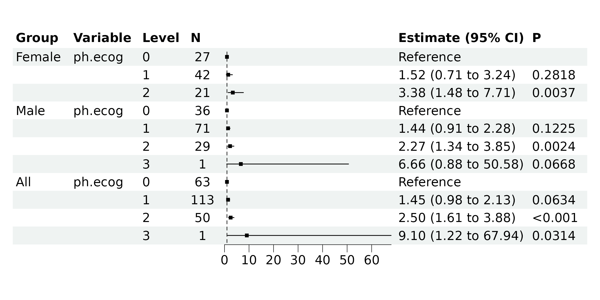

# Group Regression Analysis and Visualization

We are using the same example from the [ezcox package
vignette](https://CRAN.R-project.org/package=ezcox/vignettes/ezgroup.html).

Load the package and data.

``` r
library(bregr)
#> Welcome to 'bregr' package!
#> =======================================================================
#> You are using bregr version 1.3.1.9000
#> 
#> Project home : https://github.com/WangLabCSU/bregr
#> Documentation: https://wanglabcsu.github.io/bregr/
#> Cite as      : https://doi.org/10.1002/mdr2.70028
#>   Wang, S., Peng, Y., Shu, C., Wang, C., Yang, Y., Zhao, Y., Cui, Y., Hu, D. and Zhou, J.-G. (2025),
#>   bregr: An R Package for Streamlined Batch Processing and Visualization of Biomedical Regression Models. Med Research.
#> =======================================================================
#> 

data <- survival::lung
data <- data |>
  dplyr::mutate(
    ph.ecog = factor(ph.ecog),
    sex = ifelse(sex == 1, "Male", "Female")
  )
```

Construct grouped batch survival models to determine if the variable
`ph.ecog` has different survival effects under different sex groups.

``` r
mds <- br_pipeline(
  data,
  y = c("time", "status"),
  x = "ph.ecog",
  group_by = "sex",
  method = "coxph"
)
#> exponentiate estimates of model(s) constructed from coxph method
#> at default
```

We can examine the constructed models.

``` r
br_get_models(mds)
#> $Female_ph.ecog
#> Call:
#> survival::coxph(formula = survival::Surv(time, status) ~ ph.ecog, 
#>     data = data)
#> 
#>            coef exp(coef) se(coef)     z       p
#> ph.ecog1 0.4162    1.5161   0.3867 1.076 0.28182
#> ph.ecog2 1.2190    3.3836   0.4204 2.900 0.00374
#> ph.ecog3     NA        NA   0.0000    NA      NA
#> 
#> Likelihood ratio test=9.23  on 2 df, p=0.009894
#> n= 90, number of events= 53 
#> 
#> $Male_ph.ecog
#> Call:
#> survival::coxph(formula = survival::Surv(time, status) ~ ph.ecog, 
#>     data = data)
#> 
#>            coef exp(coef) se(coef)     z       p
#> ph.ecog1 0.3641    1.4393   0.2358 1.544 0.12251
#> ph.ecog2 0.8190    2.2682   0.2696 3.038 0.00238
#> ph.ecog3 1.8961    6.6596   1.0345 1.833 0.06682
#> 
#> Likelihood ratio test=10.46  on 3 df, p=0.01503
#> n= 137, number of events= 111 
#>    (1 observation deleted due to missingness)
#> 
#> $All_ph.ecog
#> Call:
#> survival::coxph(formula = survival::Surv(time, status) ~ ph.ecog, 
#>     data = data)
#> 
#>            coef exp(coef) se(coef)     z        p
#> ph.ecog1 0.3688    1.4461   0.1987 1.857   0.0634
#> ph.ecog2 0.9164    2.5002   0.2245 4.081 4.48e-05
#> ph.ecog3 2.2080    9.0973   1.0258 2.152   0.0314
#> 
#> Likelihood ratio test=18.44  on 3 df, p=0.0003561
#> n= 227, number of events= 164 
#>    (1 observation deleted due to missingness)
```

Now, display the results using a forest plot.

``` r
br_show_forest(mds)
```


We can optimize the plot for better visualization, for example, by
removing the second column of the table and eliminating the row with
`NA` results.

``` r
br_show_forest(
  mds,
  drop = 2,
  subset = !(Group_variable == "Female" & variable == "ph.ecog" & label == 3)
)
```



To subset the data rows, we can input an R expression using variables
from `br_get_results(mds)`. For example, we can use
`Group_variable == "Female" & variable == "ph.ecog" & label == 3` to
locate the row we want to remove, and then use `!()` to select the
negated rows.

If drop `All` group is necessary, update the `subset` with:

``` r
br_show_forest(
  mds,
  drop = 2,
  subset = !((Group_variable == "Female" & variable == "ph.ecog" & label == 3) |
    (Group_variable == "All"))
)
```


