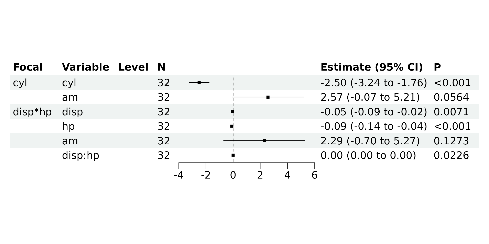
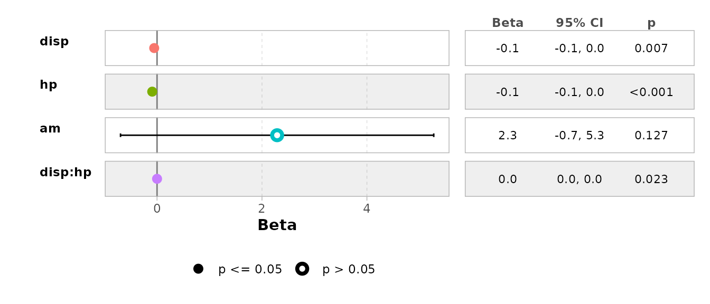
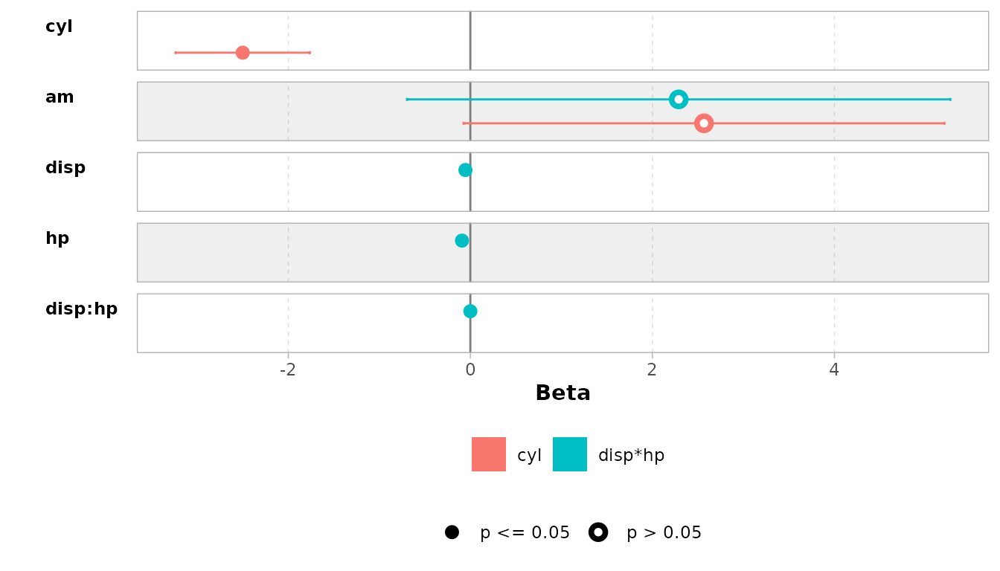

# Model Configurations

``` r
library(bregr)
#> Welcome to 'bregr' package!
#> =======================================================================
#> You are using bregr version 1.3.1.9000
#> 
#> Project home : https://github.com/WangLabCSU/bregr
#> Documentation: https://wanglabcsu.github.io/bregr/
#> Cite as      : https://doi.org/10.1002/mdr2.70028
#>   Wang, S., Peng, Y., Shu, C., Wang, C., Yang, Y., Zhao, Y., Cui, Y., Hu, D. and Zhou, J.-G. (2025),
#>   bregr: An R Package for Streamlined Batch Processing and Visualization of Biomedical Regression Models. Med Research.
#> =======================================================================
#> 
```

## Interaction Terms

The **bregr** package provides comprehensive support for the processing
and visualization of interaction terms in regression models, provided
that the interaction term is inherently supported by the model.

Below is an illustrative example using a linear model:

``` r
rv <- br_pipeline(
  data = mtcars,
  y = "mpg", x = c("cyl", "disp*hp"), x2 = "am",
  method = "lm"
)
```

Examine the results:

``` r
br_get_results(rv, tidy = TRUE)
#> # A tibble: 6 × 8
#>   Focal_variable term    estimate std.error statistic p.value conf.low conf.high
#>   <chr>          <chr>      <dbl>     <dbl>     <dbl>   <dbl>    <dbl>     <dbl>
#> 1 cyl            cyl     -2.50e+0 0.361         -6.93 1.28e-7 -3.24e+0 -1.76    
#> 2 cyl            am       2.57e+0 1.29           1.99 5.64e-2 -7.42e-2  5.21    
#> 3 disp*hp        disp    -5.42e-2 0.0186        -2.92 7.06e-3 -9.23e-2 -0.0160  
#> 4 disp*hp        hp      -9.20e-2 0.0244        -3.77 8.16e-4 -1.42e-1 -0.0419  
#> 5 disp*hp        am       2.29e+0 1.45           1.57 1.27e-1 -6.96e-1  5.27    
#> 6 disp*hp        disp:hp  2.27e-4 0.0000938      2.42 2.26e-2  3.45e-5  0.000419
```

Visualize the results:

``` r
br_show_forest(rv)
```



Additionally, specified models can be visualized using the functions
provided by **bregr**:

``` r
br_show_forest_ggstats(rv, idx = 2)
```



Or compare them:

``` r
br_show_forest_ggstats(rv)
```



## Customized GLM Family

For GLM models, the family object can be further customized with various
arguments. By default, **bregr** directly supports GLM family functions
with their default arguments, which can be viewed using:  

``` r
br_avail_methods()
#>  [1] "lm"               "coxph"            "survreg"          "clogit"          
#>  [5] "cch"              "binomial"         "gaussian"         "Gamma"           
#>  [9] "inverse.gaussian" "poisson"          "quasi"            "quasibinomial"   
#> [13] "quasipoisson"     "nls"              "aov"
```

However, for alternative GLM configurations, modifications can be made
directly. For instance, consider the following example using a
quasi-family with specified variance and link functions:

``` r
data <- data.frame(
  x = rnorm(100)
)
data$y <- rpois(100, exp(1 + data$x))
head(data)
#>              x  y
#> 1 -1.400043517  0
#> 2  0.255317055  7
#> 3 -2.437263611  0
#> 4 -0.005571287  0
#> 5  0.621552721  3
#> 6  1.148411606 12
```

``` r
rv <- br_pipeline(
  data = data,
  y = "y", x = "x",
  method = 'quasi(variance = "mu", link = "log")'
)
#> Warning: nonstandard method `quasi(variance = "mu", link = "log")` passed to
#> `stats::glm()`, double-check if it's correct
br_get_results(rv, tidy = TRUE)
#> # A tibble: 1 × 8
#>   Focal_variable term  estimate std.error statistic  p.value conf.low conf.high
#>   <chr>          <chr>    <dbl>     <dbl>     <dbl>    <dbl>    <dbl>     <dbl>
#> 1 x              x        0.952    0.0446      21.4 1.14e-38    0.865      1.04
```

This is equivalent to:

``` r
glm(y ~ x, data = data, family = quasi(variance = "mu", link = "log")) |>
  summary()
#> 
#> Call:
#> glm(formula = y ~ x, family = quasi(variance = "mu", link = "log"), 
#>     data = data)
#> 
#> Coefficients:
#>             Estimate Std. Error t value Pr(>|t|)    
#> (Intercept)  1.06874    0.06587   16.23   <2e-16 ***
#> x            0.95234    0.04456   21.37   <2e-16 ***
#> ---
#> Signif. codes:  0 '***' 0.001 '**' 0.01 '*' 0.05 '.' 0.1 ' ' 1
#> 
#> (Dispersion parameter for quasi family taken to be 1.041366)
#> 
#>     Null deviance: 582.56  on 99  degrees of freedom
#> Residual deviance: 108.46  on 98  degrees of freedom
#> AIC: NA
#> 
#> Number of Fisher Scoring iterations: 5
```
